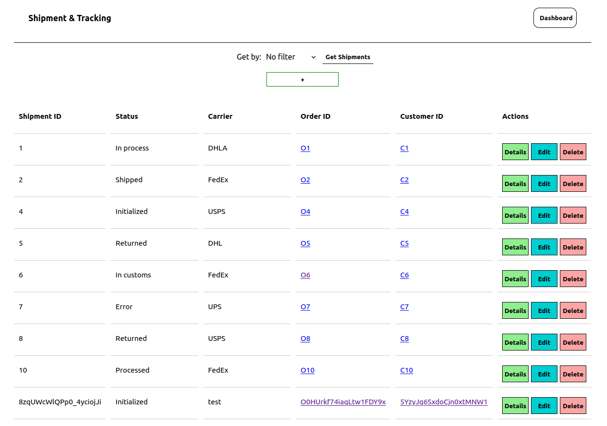

# HT zadatak 2024
Napraviti grafičko sučelje za pošiljke i praćenje pošiljci (CRUD).

Uz grafičko sučelje sam napravio i backend u ExpressJS i database u SQLite-u.
# Pokretanje:
1) Pokreniti backend (postavljen je port na 3000)
```
node server.js
```
 2) Pokreniti frontend
```
npm run dev
```

Potpuno je responzivno.


